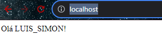

## Desafio Devops

Instalar as dependencias

```
npm install
```

Rodar o servico node

````
npm run start
````

### Serviço
porta: 3000

## Execução do Desafio Luis Simon

Link utilizado para configuração do Dockerfile e empacotamento de um container contendo a aplicação: https://nodejs.org/en/docs/guides/nodejs-docker-webapp

Comandos utilizados:
Para buildar a imagem localmente
````
docker build . -t luissimon96/node-web-app:0.1
````

Executando a Imgaem criada localmente
````
docker run -p 3000:3000 -d luissimon96/node-web-app:0.1
````

Baixando a imagem criada para uso em sua máquina
````
docker pull luissimon96/node-web-app:0.1
````

## Processo de CI/CD utilizando o Git Actions
Build: construir a imagem, foi utilizado o seguinte repo para a config: https://docs.docker.com/language/nodejs/configure-ci-cd/
Para buildar uma nova versão deve apenas atualizar qualquer arquivo na master que o job já será iniciado automaticamente via push event;

próximo passo criar um fluxo para utilizar o github actions para:

## Deploy: Implantar o pacote já construido;

Realizado o com sucesso após isso para conseguir acessar com o seguinte ambiente:
minikube v1.31.1
Docker Desktop 4.22.0
Microsoft Windows 11 Home 10.0.22621.1992 Build 22621.1992

````
kubectl apply -f .
````
````
minikube tunnel
````

obtivemos o seguinte resultado:
````
curl -v localhost
------------------
StatusCode        : 200
StatusDescription : OK
Content           : Olá LUIS_SIMON!
RawContent        : HTTP/1.1 200 OK
                    Connection: keep-alive
                    Content-Length: 16
                    Content-Type: text/html; charset=utf-8
                    Date: Tue, 08 Aug 2023 02:37:17 GMT
                    ETag: W/"10-7shNgo2aVAsAJCqJ3hLZb5Z+xFw"
                    X-Powered-By: Expres...
Forms             : {}
Headers           : {[Connection, keep-alive], [Content-Length, 16], [Content-Type, text/html; charset=utf-8], [Date, Tue, 08 Aug 2023   
                    02:37:17 GMT]...}
Images            : {}
InputFields       : {}
Links             : {}
ParsedHtml        : System.__ComObject
RawContentLength  : 16
````

E via Browser Google Chrome Versão 115.0.5790.111
